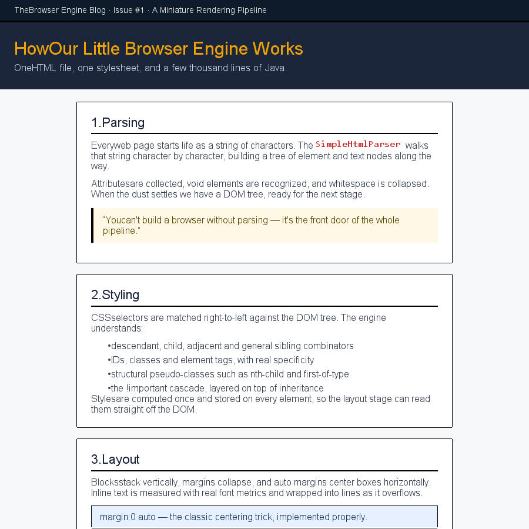
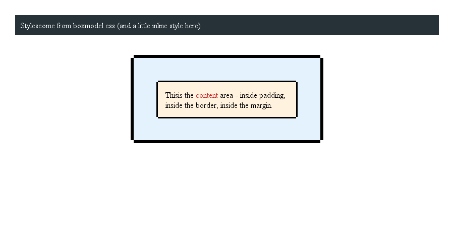
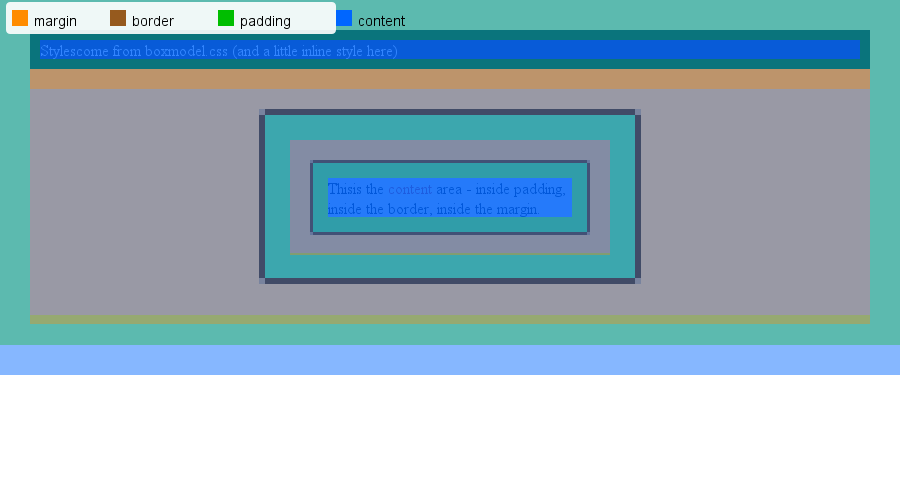
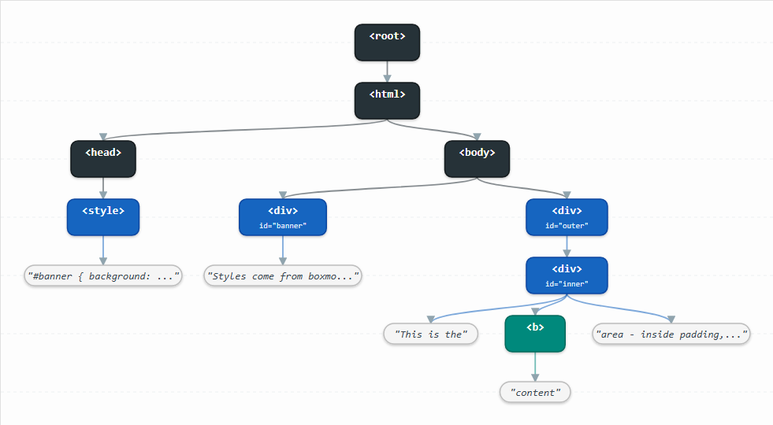

# Browser Engine

A miniature browser rendering engine written in Java. It takes an HTML file, parses it into a DOM tree, applies CSS, computes the cascade, lays the page out into boxes, and paints the result to a PNG image — plus a self-contained, interactive parse-tree report. Think of it as the essential skeleton of the Chrome/Firefox pipeline in a few thousand lines of code.

## Features

- **Hand-written HTML parser** — single-pass, tolerant of comments, declarations, CDATA and ~200 named entities
- **CSS parser & cascade** — complex selectors, combinators, pseudo-classes, specificity triples and `!important`
- **Style resolution** — browser defaults + inheritance + rules + inline `style` attributes
- **Layout engine** — block and inline layout, box model, margin collapsing, text wrapping with real font metrics
- **PNG rendering** — paints the page with Java AWT, with an optional DevTools-style box-model debug overlay
- **Parse-tree report** — a self-contained `report.html` with an SVG diagram, tree-algorithm outputs, specificity and computed-style tables

## How It Works

The engine reproduces the real browser rendering pipeline in six stages. Each stage consumes the output of the previous one:

```
 HTML file
    │  SimpleHtmlParser.parse()          build DOM tree
    ▼
 DOM tree (DomNode)
    │  extractCss()                      pull CSS out of <style> elements
    ▼
 CSS string
    │  SimpleCssParser.parse()           turn into a list of CssRule
    ▼
 List<CssRule>
    │  StyleResolver.resolveTree()       walk the DOM, compute final styles
    ▼
 DOM tree with computedStyle
    │  LayoutTreeBuilder.build()         styled DOM → layout box tree
    ▼
 Layout tree (LayoutBox)
    │  LayoutEngine.layout()             block + inline layout (box model, margins)
    ▼
 Positioned boxes + text lines
    │  Renderer.render()                 paint to a PNG (optional box-model overlay)
    ▼
 out/render.png
```

The same DOM tree feeds a parallel analysis pipeline that produces the interactive report:

```
 DOM tree
    │  DomTreeBuilder.build()            → generic Tree<TreeNode<DomNode>>
    ▼
 Tree<TreeNode<DomNode>>
    │  Tree.preOrder()/postOrder()/levels()   run the tree algorithms
    │  ReportGenerator.generate()        → SVG diagram + specificity + computed styles
    ▼
 out/report.html
```

### Stage by stage

| Stage | Component | What happens |
|---|---|---|
| 1. Parse | `html/SimpleHtmlParser` | Walks the source char-by-char and builds the DOM tree, stripping whitespace-only text between elements. Handles comments, `<!DOCTYPE>` declarations, CDATA sections and character references. |
| 2. Extract CSS | `Main.extractCss()` | Collects the text content of every `<style>` element into one CSS string. An optional external CSS file is appended after it (so external rules win on ties). |
| 3. Parse CSS | `css/SimpleCssParser` | Splits the CSS into `CssRule` objects: selectors + declarations, each carrying an `!important` flag. |
| 4. Resolve styles | `style/StyleResolver` | Computes each element's final style by layering browser defaults → inherited properties → matching rules (sorted by specificity) → inline `style=""` attributes. |
| 5. Layout | `layout/*` | `LayoutTreeBuilder` turns the styled DOM into a box tree (block/inline/anonymous-block). `LayoutEngine.layout()` walks it with a viewport size, computing dimensions and stacking boxes and text lines (including vertical margin collapsing). |
| 6. Render | `layout/Renderer` | Paints the box tree onto a `BufferedImage` and writes it as a PNG via `ImageIO`. |

## How the Images Are Generated

The engine writes **two kinds of images**, both to the `out/` folder:

### 1. The rendered page — `out/render.png`

`Renderer.render()` builds a `BufferedImage` the size of the viewport and walks the layout tree recursively:

1. **Background** — fills the canvas white, then paints each box's `background-color` over its padding-box rectangle.
2. **Borders** — for each side with a non-zero `border-*-width`, fills a thin rect along that edge.
3. **Text** — for every `TextFragment` in every `LineBox`, sets the font (via real AWT font metrics from `TextMetrics.fontFor()`), picks the color from the computed style, and draws the string at its measured position with `g.drawString()`.
4. **Children** — recurses into child boxes in document order, so later (deeper) elements paint on top.

The output is written with `javax.imageio.ImageIO.write(img, "png", ...)`. Text is anti-aliased.

### 2. The box-model debug overlay — `out/render-boxmodel.png`

Pass the `--boxmodel` flag to paint the same page again with a DevTools-style overlay on top:

| Color | Region |
|---|---|
| <span style="color:#0066ff">blue</span> | content |
| <span style="color:#00be00">green</span> | padding |
| <span style="color:#965a1e">brown</span> | border |
| <span style="color:#ff8c00">orange</span> | margin |

Each region is drawn as translucent fills between the box's content, padding, border and margin rectangles, with a color legend in the top-left corner.

> The images under `docs/` in this repo are generated by the engine itself (e.g. `boxmodel.html` with `--boxmodel`) and committed so they survive the per-run `out/` cleanup.

## Project Structure

```
src/main/java/org/example/browser/
├── Main.java                  entry point: loads files, runs the pipeline, prints results
│
├── html/
│   └── SimpleHtmlParser.java  hand-written HTML parser → DOM tree
│
├── dom/
│   ├── DomNode.java           common node API (name, attributes, children, text)
│   ├── ElementNode.java       a tag node (div, span, …) + its computed style
│   └── TextNode.java          a text leaf node
│
├── css/
│   ├── CssRule.java           a rule: selectors + declarations (!important flags)
│   ├── CssSelector.java       chain of compound selectors joined by combinators
│   ├── SimpleSelector.java    one compound selector: tag / id / class / pseudo-classes
│   ├── CssDeclaration.java    a property declaration (value + !important flag)
│   └── SimpleCssParser.java   CSS string → List<CssRule>
│
├── style/
│   └── StyleResolver.java     computes final styles (defaults + inheritance + rules + inline)
│
├── layout/                    the box tree + layout + rendering
│   ├── LayoutTreeBuilder.java styled DOM → layout box tree (block/inline + anonymous blocks)
│   ├── LayoutEngine.java      entry point: lays out a tree in a viewport; prints the box tree
│   ├── LayoutBox.java         one box: type, element, style spec, dimensions, children, text lines
│   ├── BoxType.java           BlockNode / InlineNode / AnonymousBlock
│   ├── BoxSpec.java           parsed style: lengths, colors, font info
│   ├── Length.java            a length: px / percent / auto
│   ├── BoxDimensions.java     content / padding / border / margin rects
│   ├── Rect.java              rectangle
│   ├── EdgesSizes.java        per-edge sizes
│   ├── BlockLayout.java       block layout: widths, auto margins, child stacking, heights
│   ├── InlineLayout.java      wraps inline text into lines (measure + word wrap)
│   ├── LineBox.java           a line of text
│   ├── TextFragment.java      one word in a line
│   ├── TextMetrics.java       real font metrics via java.awt.Font
│   ├── MarginCollapser.java   vertical margin collapsing
│   └── Renderer.java          paints the page to a PNG (optional box-model debug overlay)
│
├── tree/                      generic tree data structure + algorithms
│   ├── TreeNode.java          node with value, parent pointer, list of children
│   └── Tree.java              preOrder(), postOrder(), levels() (BFS), height, nodeCount, leafCount
│
├── report/                    the parse-tree report generator
│   ├── DomTreeBuilder.java    DOM tree → generic Tree<TreeNode<DomNode>> (wraps under <root>)
│   ├── ReportGenerator.java   builds out/report.html: stats, highlighted source, SVG diagram,
│   │                          tree-algorithm outputs, rule specificity, computed-style tables
│   └── HtmlUtil.java          HTML escaping for the generated report
```

Sample files:

```
src/main/resources/            bundled defaults used when no arguments are given
├── index.html                 demo markup with an embedded <style> block
└── style.css                  demo external stylesheet

project root                  extra demo pages (resolved from the filesystem)
├── article.html / article.css     a long-form blog page with sections, lists, quotes
├── boxmodel.html / boxmodel.css   a box-model demo, best run with the --boxmodel flag
└── demo.html / demo.css           another demo page
```

## Requirements

- Java 17 or newer
- Maven

## Getting Started

Build and run with the bundled defaults (`index.html` + `style.css`):

```bash
mvn compile
mvn exec:java
```

This prints the extracted CSS, the number of parsed rules, the DOM tree with computed styles, the layout tree, and writes `out/render.png` plus `out/report.html`.

### CLI arguments

| Position | Meaning | Default |
|---|---|---|
| `args[0]` | HTML file (filesystem path or bundled resource name) | `index.html` |
| `args[1]` | External CSS file (merged after the embedded `<style>` CSS) | `style.css` |
| `args[2]` | Viewport width in px | `800` |
| `args[3]` | Viewport height in px | `600` |
| `args[4]` | `--boxmodel` → also write `out/render-boxmodel.png` with the debug overlay | — |
| `args[5]` | Custom output path for the content image (box-model image gets a `-boxmodel` suffix) | `out/render.png` |

### Examples

**HTML only** (CSS comes from the `<style>` block inside the HTML):

```bash
mvn exec:java "-Dexec.args=C:\path\to\page.html"
```

**HTML + external CSS** (merged after the embedded `<style>` CSS):

```bash
mvn exec:java "-Dexec.args=C:\path\to\page.html C:\path\to\style.css"
```

**Files inside `src/main/resources`** (pass the filename only — the loader falls back to the classpath):

```bash
mvn exec:java "-Dexec.args=index.html style.css"
```

**Box-model demo with the debug overlay:**

```bash
mvn exec:java "-Dexec.args=boxmodel.html boxmodel.css 900 500 --boxmodel"
```

**Article/blog demo (long page — good for the parse-tree report):**

```bash
mvn exec:java "-Dexec.args=article.html article.css 900 900"
```

**Extra demo page:**

```bash
mvn exec:java "-Dexec.args=demo.html demo.css"
```

> **PowerShell note:** wrap the whole `-Dexec.args=...` argument in quotes. On CMD you can write `-Dexec.args="C:\path\page.html"` instead.

### Alternative: run with `java` directly

```bash
mvn compile
java -cp target/classes org.example.browser.Main C:\path\to\page.html C:\path\to\style.css
```

### How file loading works

`Main.loadText()` checks the filesystem first; if the path does not exist, it falls back to a bundled resource with the same name.

| Command | HTML source | CSS source |
|---|---|---|
| `mvn exec:java` | bundled `index.html` | `<style>` + bundled `style.css` |
| `mvn exec:java "-Dexec.args=page.html"` | your `page.html` | `<style>` + bundled `style.css` |
| `mvn exec:java "-Dexec.args=page.html style.css"` | your file | `<style>` + your `style.css` |

### Output folder

The `out/` folder is cleared on every run, so it always holds only the **latest** pair:

| File | Contents |
|---|---|
| `out/render.png` | the plain page (content) image |
| `out/render-boxmodel.png` | with the box-model debug overlay (only if `--boxmodel` is passed) |
| `out/report.html` | the self-contained parse-tree report (written on every run) |

## Deep Dive

### HTML parser

`SimpleHtmlParser` is a hand-written single-pass parser. It walks the source character by character and builds the DOM tree while collapsing whitespace-only text between elements. Beyond plain `<tag>` / `</tag>` / `attr="value"` handling, it understands:

- **Comments** — `<!-- ... -->` are skipped entirely.
- **Declarations** — `<!DOCTYPE html>` and any other `<!...>` declaration are consumed and ignored.
- **CDATA sections** — `<![CDATA[...]]>` is kept as a raw text node; its content is *not* entity-decoded.
- **Character references** — decoded while parsing:
  - decimal `&#38;` → `&`
  - hexadecimal `&#x26;` → `&`
  - named entities (`&amp;`, `&lt;`, `&gt;`, `&quot;`, `&nbsp;`, `&mdash;`, `&hellip;`, …) from a table of ~200 common HTML entities.
  - decoding is **single-pass**: `&amp;lt;` becomes `&lt;` and is left alone (no double decoding).

### Style computation

`StyleResolver` builds each element's final style by layering sources in order of increasing priority:

1. **Browser defaults** — a tiny user-agent stylesheet (display, margins, padding, color, font-size, …)
2. **Inherited properties** from the parent (`color`, `font-size`, `font-family`)
3. **All matching CSS rules**, sorted by specificity (`#id` = 100, `.class` = 10, `tag` = 1)
4. **Inline `style="..."` attributes** — highest priority

External CSS is appended after embedded `<style>` CSS, so on ties the external rules win (source order).

### CSS selector support

Selectors are parsed into a chain of compound parts joined by combinators and matched **right-to-left** against the DOM tree (nodes carry a parent pointer for ancestor/sibling traversal).

**Combinators:**

| Selector | Meaning |
|---|---|
| `div p` | descendant — any `p` inside a `div` |
| `div > p` | child — direct child only |
| `h2 + p` | adjacent sibling — `p` immediately after `h2` |
| `h2 ~ p` | general sibling — any `p` after `h2` |
| `*` | universal — matches any element |

**Pseudo-classes:**

- `:first-child`, `:last-child`, `:only-child`
- `:nth-child(An+B)` — also `odd`, `even`, and plain numbers (e.g. `2n+1`, `-n+3`, `3`)
- `:first-of-type`, `:last-of-type`, `:nth-of-type(An+B)`
- `:not(selector)` — accepts one compound selector as its argument
- Interaction pseudo-classes (`:hover`, `:active`, `:focus`, `:visited`, `:link`) parse but never match, since the engine has no interaction state

**Cascade & specificity:**

- Specificity is a true `(ids, classes, types)` triple summed over every compound part (including `:not()` arguments), compared lexicographically — not just a flat number.
- A rule's cascade weight comes from the **highest-specificity selector that actually matched**.
- Ties are broken by source order (the stable sort keeps the later rule winning).
- `!important` declarations win over all normal ones; among important declarations, specificity and source order still apply.
- Priority: `normal rules → normal inline → !important rules → !important inline`.

**Example:**

```css
ul li { color: green; }                 /* descendant: all <li> inside <ul>      */
div > p { color: purple; }              /* child only                             */
li:nth-child(2n+1) { background: yellow; } /* odd rows                            */
p.note { color: red !important; }       /* beats any normal rule, even #wrap p    */
```

### The parse-tree report (`out/report.html`)

Every run writes `out/report.html` — a single self-contained HTML page (no external assets) that shows how the HTML was parsed and how the CSS was resolved:

1. **Stats cards** — DOM node count, tree height, leaf count, number of CSS rules.
2. **Input HTML** — syntax-highlighted, with the input CSS in a collapsible `<details>` block.
3. **DOM parse tree** — an SVG diagram of the whole tree:
   - nodes are colored by kind (structural `html/body/head` = slate, block elements = blue, inline elements = teal, headings = purple, text nodes = white pills);
   - node size adapts to its label/attributes;
   - parent→child edges are cubic Bézier curves with arrowheads;
   - dashed horizontal guide lines mark each tree level;
   - a legend explains the color scheme;
   - a **"Show traversal indices"** checkbox (default off) reveals each node's pre-order, post-order, BFS level and BFS index badges.
4. **Tree algorithms** — the pre-order (DFS discovery), post-order (DFS finish) and BFS level-order lists produced by the `tree` package.
5. **Parsed CSS rules** — every rule with its selectors, computed specificity `(ids, classes, types)` and declarations.
6. **Computed styles** — the final cascade output for each element (with expand/collapse-all buttons).

The SVG layout uses a bottom-up **tidy algorithm**: each node is centered over its children, and sibling subtrees are spaced so their bounding envelopes never overlap (a `GAP` between contours at every depth). Node widths are measured from the actual label/attribute text, so the diagram stays compact.

## Screenshots

All images below are generated by the engine itself and committed under `docs/` so they survive the `out/` cleanup.

**The rendered article page** (`mvn exec:java "-Dexec.args=article.html article.css 900 900"`):



**The box-model demo page**, plain and with the debug overlay (`mvn exec:java "-Dexec.args=boxmodel.html boxmodel.css 900 500 --boxmodel"`):





**The DOM parse-tree diagram** from `out/report.html` (click to view at full size):

<a href="docs/report-tree.png"></a>

## Known Limitations

- The HTML parser assumes well-formed input; it does not validate that closing tags match.
- The named-entity table covers ~200 common entities, not the full HTML5 list; unknown references are left as-is. CDATA is kept as raw text, but there is no special handling of raw-text elements (`<script>`, `<style>`, `<textarea>`) beyond what the parser does today.
- No attribute selectors (`[type="text"]`) or pseudo-elements (`::before`) yet.
- `:not()` accepts only a single compound selector (no comma lists or combinators).
- Structural pseudo-classes count only element siblings (whitespace-only text nodes are already stripped by the HTML parser).
- No cascade tie-breaking beyond source order, no `!important` for inline styles beyond what is listed above.
- The layout engine handles block and inline boxes only (no floats, positioning, flex/grid); only `background-color` (plus the `background` shorthand) and `border-*-width` are painted; inline elements get no box (their width is measured but they don't produce boxes or wrap on their own line).
- `TextMetrics` uses Java AWT font metrics, so results vary with the platform's fonts.
- The SVG diagram approximates text width with a fixed per-character estimate, and edges are drawn as a single straight Bézier per parent→child pair, so very wide trees can still look dense.

## Testing

The engine ships with unit tests for the core pipeline, written in **JUnit 4** under `src/test/java/org/example/browser/`:

- `html/SimpleHtmlParserTest` — DOM parsing, attributes, comments, entities, whitespace
- `css/SimpleCssParserTest` — selectors, combinators, pseudo-classes, `!important`, specificity, shorthands
- `style/StyleResolverTest` — cascade priority, inheritance, inline styles
- `layout/LengthTest` — length parsing and resolution

Run them with:

```bash
mvn test
```

## Next Steps

Ideas for extending the project:

- inline element boxes (width/height on `span`/`a` etc.), line-height, and `vertical-align`
- floats, `position`, flexbox / grid layout
- attribute selectors (`[type="text"]`), pseudo-elements (`::before`), richer `:not()` lists
- the full HTML5 named-entity table, raw-text element handling, and parser error recovery
- multi-cascade layering (user agent < user < author < !important)
- navigation and page loading over HTTP
